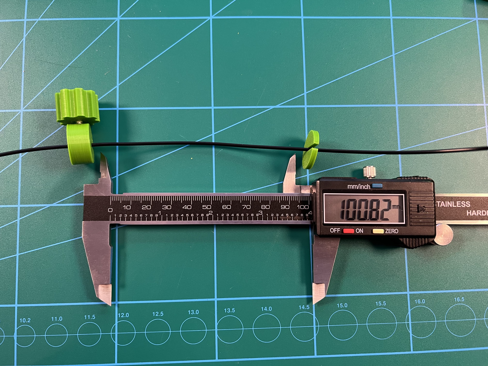
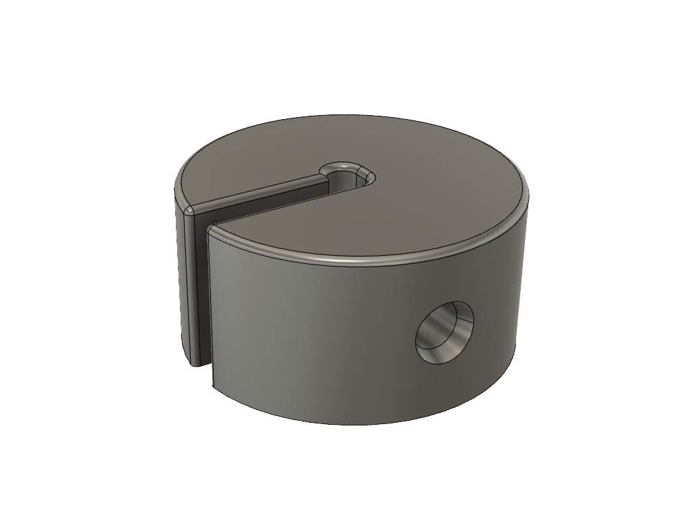

# Filament Calliper / Skydelære

Du kan bruge denne lille holder til at måle distancen på dit filament til kalibrering af E-Steps af filament.

Den lille base kan bruges hvis man har en ikke flad extruder eller et punkt der er fast du kan refere til kan man bruge [Base.stl](stl/Base.stl)

Man kan enten bruge [Knob.stl](stl/Knob.stl) med en M3 bolt, eller en M3 Cap Head screw og en umbraco nøgle eller ligende. dvs. har man ikke en M3 bolt med HEX hoved skal man ikke printe Knob.stl

## Samlet

## Clamp
* [Clamp.stl](stl/clamp.stl)
* [Clamp.step](step/clamp.step)

## Knob
* [Knob.stl](stl/knob.stl)
* [Knob.step](step/knob.step)

## Base
* [Base.stl](stl/base.stl)
* [Base.step](step/base.step)
